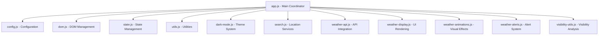

# 🌤️ Simple Weather App

> A sophisticated, feature-rich weather application built with modern web technologies, modular JavaScript architecture, and comprehensive testing infrastructure.

    

## 🌟 Key Features

### 🌍 **Comprehensive Weather Intelligence**
- **Real-time Current Conditions** - Temperature, humidity, wind speed, UV index
- **Advanced Visibility Analysis** - Detailed visibility insights with driving & activity recommendations
- **3-Day Detailed Forecast** - Daily forecasts with weather icons and temperature ranges
- **Smart Location Services** - Automatic GPS detection + manual city search worldwide

### 🎨 **Premium User Experience**
- **Dynamic Weather Animations** - Rain particles, snow effects, sunny glows, storm animations
- **Dark/Light Theme Toggle** - Seamless theme switching with persistent preferences
- **Fully Responsive Design** - Optimized for all devices (desktop, tablet, mobile)
- **Intelligent Loading States** - Smooth animations and helpful error messages

### ⚠️ **Advanced Alert System**
- **European Weather Alerts** - Real-time severe weather warnings via MeteoAlarm
- **Smart Filtering** - Location-based alert filtering with severity classification
- **Multi-language Support** - UTF-8 encoded international alert descriptions
- **Visual Alert Hierarchy** - Color-coded severity levels (Extreme → Minor)

### 🔧 **Technical Excellence**
- **Modular Architecture** - 13 focused JavaScript modules for maximum maintainability
- **Modern Web Standards** - ES6 modules, CSS Grid, Flexbox, CSS Variables
- **Performance Optimized** - Efficient API usage, caching, and minimal DOM manipulation
- **Robust Error Handling** - Comprehensive error management with user-friendly feedback
- **Comprehensive Testing** - Custom test framework with 25+ tests covering all major functionality

---

## 🚀 Quick Setup

### Prerequisites
- Modern web browser (Chrome 80+, Firefox 75+, Safari 13+, Edge 80+)
- Internet connection for weather data
- Local web server (required for geolocation and ES6 modules)

### 1️⃣ Get Your Free API Key
1. Visit [WeatherAPI.com](https://www.weatherapi.com/signup.aspx) 
2. Create a free account (1M+ API calls/month included)
3. Copy your API key from the dashboard

### 2️⃣ Configure the Application
Edit `js/config.js` and replace the placeholder:
```javascript
const API_KEY = 'your_actual_api_key_here'; // Replace this line
```

### 3️⃣ Start a Local Server
**Option A: Python (Recommended)**
```bash
cd weather-app
python3 -m http.server 8080
# Open: http://localhost:8080
```

**Option B: Node.js**
```bash
npx serve -p 8080
# or: npm install -g serve && serve -p 8080
```

**Option C: Development Tools**
- VS Code Live Server extension
- Any static file server

### 4️⃣ Launch & Enjoy! 🎉
The app will automatically:
- Request location permission
- Load current weather & forecast
- Apply weather-appropriate animations
- Check for relevant weather alerts

---

## 📋 Advanced Features Deep Dive

### 🔍 **Intelligent Visibility Analysis**
Our advanced visibility system provides:
- **7-Category Classification** (Excellent → Extreme conditions)
- **Contextual Weather Analysis** (fog, rain, snow impact assessment)
- **Driving Safety Recommendations** (speed adjustment, light usage, hazard protocols)
- **Activity Suitability Guidance** (hiking, photography, outdoor sports)
- **Real-time Condition Updates** with expandable detail panels

### 🎭 **Dynamic Weather Animations**
- **Rain Effects** - Realistic falling rain particles with varying intensity
- **Snow Animation** - Gentle snowfall with wind-influenced particle movement  
- **Sunny Glow** - Warm, radiant background effects for clear skies
- **Storm Visuals** - Lightning flashes and stormy atmosphere
- **Cloud Transitions** - Smooth cloudy sky background effects
- **Wind Animations** - Visual wind intensity indicators

### 🌐 **Smart Location System**
- **GPS Auto-detection** with fallback options
- **Global City Search** with intelligent matching
- **Location Memory** for quick access to recent searches
- **Manual Override** when automatic detection fails

---

## 🏗️ Architecture Overview

### Modular Design Philosophy
This application is built using a **modern modular architecture** that separates concerns and ensures maintainability:



### Module Responsibilities
| Module | Purpose | Key Features |
|--------|---------|-------------|
| `config.js` | Configuration & API keys | Centralized settings, API endpoints |
| `dom.js` | DOM element management | Element caching, validation |
| `state.js` | Application state | Centralized state management |
| `utils.js` | Shared utilities | Date formatting, encoding utilities |
| `dark-mode.js` | Theme management | Persistent preferences, smooth transitions |
| `search.js` | Location services | Geolocation, city search, autocomplete |
| `weather-api.js` | External APIs | WeatherAPI.com integration, error handling |
| `weather-display.js` | UI rendering | Weather data display, forecast cards |
| `weather-animations.js` | Visual effects | Dynamic animations, particle systems |
| `weather-alerts.js` | Alert system | MeteoAlarm integration, alert filtering |
| `visibility-utils.js` | Visibility analysis | Advanced visibility intelligence |

---

## 🔗 API Integrations

### Primary Weather Data: [WeatherAPI.com](https://weatherapi.com)
- **Free Tier**: 1,000,000 calls/month
- **Coverage**: Global weather data
- **Features**: Current conditions, forecasts, location search
- **Data Quality**: High-resolution weather icons and accurate data

### Weather Alerts: [MeteoAlarm](https://meteoalarm.org)
- **Coverage**: All European countries
- **Cost**: Completely free public service
- **Features**: Severe weather warnings, multiple languages
- **Data**: RSS/XML feeds with CORS proxy handling

---

## 🧪 Testing Infrastructure

### Comprehensive Test Suite
The application includes a **robust testing infrastructure** with a custom-built test framework and comprehensive test coverage:

#### 🎯 **Test Coverage**
- **Search Functionality** - Location search, geolocation, input validation
- **State Management** - Application state handling, data persistence, state reset
- **Utility Functions** - Date formatting, string operations, validation helpers
- **UI Components** - Weather display, dark mode toggle, responsive behavior
- **Weather Features** - API integration, alerts system, animations
- **Error Handling** - Graceful degradation, fallback mechanisms

#### 🚀 **Modern Test Runner**
Launch the interactive test runner: `tests/test-runner.html`

**Features:**
- **Beautiful UI** - Modern interface with progress tracking and animations
- **Real-time Progress** - Live test execution with detailed progress indicators
- **Comprehensive Reports** - Pass/fail statistics with detailed error messages
- **Visual Feedback** - Color-coded results with success celebrations
- **Mobile Responsive** - Works perfectly across all devices

#### 📋 **Test Modules**
| Test File | Purpose | Test Count |
|-----------|---------|------------|
| `search-minimal.test.js` | Search functionality & DOM interaction | 8+ tests |
| `state-manager.test.js` | Application state management | 12+ tests |
| `utils.test.js` | Utility functions & helpers | Multiple tests |
| `weather-display-minimal.test.js` | UI rendering & display | Multiple tests |
| `dark-mode-minimal.test.js` | Theme switching functionality | Multiple tests |
| `weather-alerts-simple.test.js` | Alert system testing | Multiple tests |

#### 🛠️ **Running Tests**
1. **Start Local Server** (required for module imports)
   ```bash
   python3 -m http.server 8080
   ```

2. **Open Test Runner**
   ```
   http://localhost:8080/tests/test-runner.html
   ```

3. **Click "🚀 Run Tests"** and watch the magic happen!

#### 🧩 **Test Framework Features**
- **Custom Assertions** - `expect().toBe()`, `toEqual()`, `toBeNull()`, `not.toThrow()`
- **Test Organization** - `describe()` blocks for logical grouping
- **Setup/Teardown** - `beforeEach()` for test isolation
- **Error Handling** - Graceful handling of missing DOM elements
- **Mocking Support** - DOM element mocking for unit testing
- **Async Support** - Promise-based test execution

#### 📊 **Test Quality Features**
- **DOM Safety** - Tests handle missing DOM elements gracefully
- **State Isolation** - Each test runs with clean state
- **Error Recovery** - Framework continues even if individual tests fail
- **Comprehensive Coverage** - Tests cover both happy path and error conditions
- **Real Environment** - Tests run against actual application code

---

## 💻 Development & Customization

### Local Development Setup
```bash
# Clone the repository
git clone <repository-url>
cd weather-app

# Optional: Install development tools
npm install -g live-server

# Start with auto-reload
live-server --port=8080
```

### Easy Customizations
- **🎨 Themes**: Modify CSS variables in `styles.css`
- **🌈 Colors**: Update color schemes and gradients
- **⏱️ Refresh Rate**: Adjust `REFRESH_INTERVAL` in `config.js`
- **🎭 Animations**: Add new weather effects in `weather-animations.js`
- **📊 Data Points**: Extend forecast duration or add new metrics

### Advanced Extensions
- **🔌 New APIs**: Integrate additional weather providers
- **📱 PWA Features**: Add offline support and notifications
- **🌍 Translations**: Implement multi-language support
- **📈 Analytics**: Add privacy-respecting usage analytics

---

## 🚀 Deployment Options

### Static Hosting (Recommended)
| Platform | Features | Best For |
|----------|----------|----------|
| **GitHub Pages** | Free, automatic deployments | Open source projects |
| **Netlify** | Drag & drop, form handling | Quick prototypes |
| **Vercel** | Git integration, preview deployments | Modern development |
| **Firebase Hosting** | Google CDN, SSL included | Production apps |

### Deployment Checklist
- ✅ Update API key in `js/config.js`
- ✅ Test across multiple browsers and devices
- ✅ Verify HTTPS for geolocation features
- ✅ Optimize assets for production
- ✅ Configure proper cache headers

---

## 🛠️ Troubleshooting

### Common Issues & Solutions

**🌍 Location Problems**
```
Issue: "Location access denied"
Solution: Allow location permissions or use manual search
```

**🔑 API Issues**
```
Issue: "Invalid API key"
Solution: Verify API key in js/config.js is correct
```

**📱 Loading Problems**
```
Issue: App won't load
Solution: Ensure serving over HTTP(S), not file:// protocol
```

**⚠️ Alert Issues**
```
Issue: No weather alerts shown
Solution: Alerts are Europe-only; ensure location is European
```

### Debug Tools
- **Browser Console**: Use `window.app` for manual controls
- **Network Tab**: Check API response status
- **Application Tab**: Verify local storage for preferences
- **Console Logs**: Detailed error messages for each module
- **Test Runner**: Use `tests/test-runner.html` to verify component functionality

---

## 📊 Performance & Privacy

### Performance Features
- **⚡ Efficient Caching**: Reduces redundant API calls
- **🔄 Smart Refresh**: Automatic data updates every 10 minutes
- **📱 Responsive Images**: Optimized weather icons
- **🎯 Minimal DOM**: Efficient rendering and updates

### Privacy-First Approach
- **🔒 No Tracking**: Zero analytics or data collection
- **💾 Local Storage**: Preferences stored locally only
- **🔐 Secure APIs**: No personal data in weather requests
- **🌐 CORS Compliant**: Proper cross-origin handling

---

## 📜 License

**MIT License** - Free for personal and commercial use

### What You Can Do:
- ✅ Use in personal and commercial projects
- ✅ Modify and distribute freely
- ✅ Create derivative works
- ✅ No attribution required (but appreciated!)

---

## 🤝 Contributing

We welcome contributions! This modular architecture makes it easy to:

1. **🎯 Find the Right Module**: Each feature has a dedicated module
2. **📋 Follow Patterns**: Consistent code style and structure
3. **🧪 Test Thoroughly**: Run test suite and add tests for new features
4. **📚 Document Changes**: Update relevant documentation
5. **✅ Verify Quality**: Use the test runner to ensure no regressions

### Feature Requests & Bug Reports
- Use GitHub Issues for bug reports and feature requests
- Include browser version, steps to reproduce, and expected behavior
- Screenshots and console logs help with debugging

---

<div align="center">

**🌟 Star this project if you find it useful!**

*Built with 💖 using modern web technologies, best practices and Cursor*


</div>
